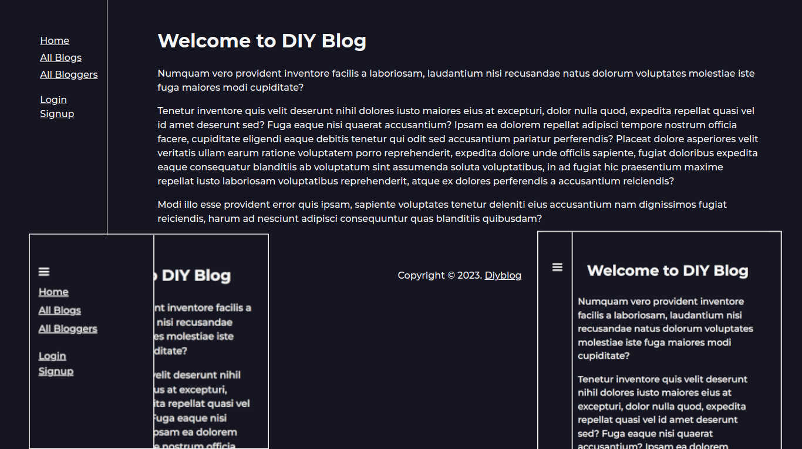

<h1 align="center">Diy Blog - MDN Django blog assignment</h1>

  

---

## Features

1. Mobile Responsiveness.
   - Working mobile Nav.
2. Dark mode support.
3. User Authentication:
   - Login
   - Signup
   - Logout
4. Password reset if forgot via email.
5. Upgrading to staff member.
6. Create a post via the application.
7. Comment on a post via the application.
8. Posts Pagination (5 posts per page)

---

## Pages

- <a href="http://localhost:5000">Home Page</a> ( Application home page )
- Signup page ( For creating a new user )
- Login Page ( For authenticating created users )
- Logout Page ( For Logging out out the application )
- Blog posts page ( For showing all the posts in the Database )
  - Blog post details page ( For showing information concerning a particular blog post )
  - Comment Page ( For commenting on a particular blog post )
- Bloggers Page ( For showing all the staff members or users who are able to create posts )
  - Blogger details page ( For showing a staff member's details )
